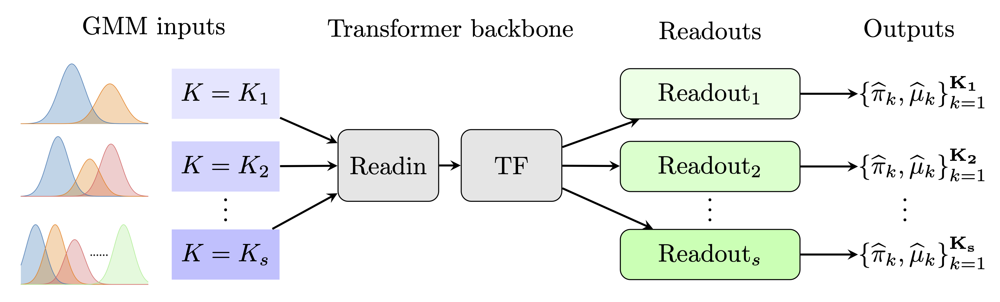

<div align="center">
<h1> Transformers for Gaussian Mixture Models (TGMM)</h1>
<h3>Transformers as Unsupervised Learning Algorithms: A study on Gaussian Mixtures</h3>

Zhiheng Chen<sup>1</sup>, Ruofan Wu<sup>2</sup>, Guanhua Fang<sup>2</sup>

<sup>1</sup> Shanghai Center for Mathematical Sciences, Fudan University  
<sup>2</sup> Department of Statistics and Data Science, Fudan University

</div>

<p align="center">
  
</p>

[](https://arxiv.org/abs/2505.11918)

## Get started
### Learning to solve an isotropic GMM
> [!NOTE]
> By the time of release, the codes are tested on ``python3.12`` with core libraries ``torch 2.7.0`` and ``transformers 4.51.3``.  

Environment setup and example usage:

```shell
git clone https://github.com/Rorschach1989/transformer-for-gmm.git
cd transformer-for-gmm
python3.12 -m venv tgmm
source tgmm/bin/activate
pip install -r requirements.txt
python run_one_config.py --config config/example_config.yaml
```

### Alternative architectures
The ``tgmm`` framework supports using [Mamba2](https://arxiv.org/abs/2405.21060) as the backbone by setting the ``model.model_type`` field to be ``mamba2``. To smoothly run tgmm experiments using the mamba2 architecture, it is highly recommended to install the additional requirements in [The official mamba repo](https://github.com/state-spaces/mamba).

### Beyond isotropic GMMs
The ``tgmm`` framework supports solving anisotropic GMM tasks via setting the ``task.type`` field to be ``MultiTaskAnisotropicGaussianMixture``

### Reproduce results in the paper
The following shell scripts reproduces the experimental results in our paper.

```shell
chmod +x ./run_template.sh  # Or edit it to be any configurations of interest
./run_template.sh
```

### Integrate with (Open-source) large language models (InstructTGMM)
The ``tgmm`` framework also supports passing input problems via language instructions with a minor tweak on the training procedure. Please refer to [this prompt](tgmm/utils/prompt.py) for our initial design of task instruction. An example script illustrating the pipeline of ``InstructTGMM`` is
```shell
chmod +x ./run_instruct_tgmm.sh  # Before running, remember to set the proper backbone LLM
./run_instruct_tgmm.sh
```

### (Optional) Visualization via pushing to ``wandb``

The following script push all the experiment logs in ``<directory_to_push>`` to a wandb workspace named ``TGMM``. Remember to create this workspace before pushing.

```shell
python push_to_wandb.py --project_root <directory_to_push> --exp_prefix <some_prefix>
```

## Acknowledgements
Our implementation is partially inspired by the following repos:
- [What Can Transformers Learn In-Context? A Case Study of Simple Function Classes](https://github.com/dtsip/in-context-learning)
- [Transformers as Statisticians: Provable In-Context Learning with In-Context Algorithm Selection](https://github.com/allenbai01/transformers-as-statisticians)

## Citation
If you find this repository helpful, please consider giving a star ⭐ and a citation

```bib
@misc{chen2025transformersunsupervisedlearningalgorithms,
      title={Transformers as Unsupervised Learning Algorithms: A study on Gaussian Mixtures}, 
      author={Zhiheng Chen and Ruofan Wu and Guanhua Fang},
      year={2025},
      eprint={2505.11918},
      archivePrefix={arXiv},
      primaryClass={cs.LG},
      url={https://arxiv.org/abs/2505.11918}, 
}
```